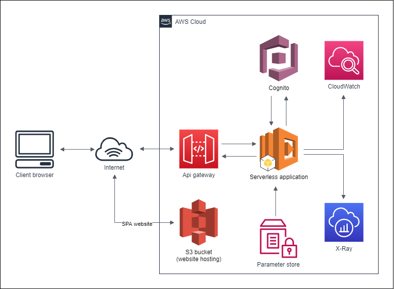

# AWS-cognito-serverless

## Prerequisites
- installed Node.js
- AWS CLI, configured credentials

### Serverless
in `/serverless-cognito-service`
```
npm i -g serverless
npm i --save serverless-finch
npm i --save serverless-python-requirements
```

### React (frontend)
in `/serverless-cognito-service/frontend`
```
npm i
```

## Usage
1. in `/serverless-cognito-service` run `serverless deploy`

After running deploy, you should see output similar to:
```
  Service Information
  service: rk-cognito-sls
  stage: dev
  region: eu-central-1
  stack: rk-cognito-sls-dev
  resources: 80
  api keys:
    None
  endpoints:
    POST - https://j12rzplytj.execute-api.eu-central-1.amazonaws.com/dev/signUp
    ...
    POST - https://j12rzplytj.execute-api.eu-central-1.amazonaws.com/dev/resendCode
  functions:
    signUp: rk-cognito-sls-dev-signUp
    ...
    resendVerificationCode: rk-cognito-sls-dev-resendVerificationCode
  layers:
    pythonRequirements: arn:aws:lambda:eu-central-1:365087808786:layer:rk-cognito-sls-layer:17
```

2. in `/serverless-cognito-service/frontend/src/config.js` change `BASE_URL` to generated URL from output above
Example:
```
export const BASE_URL = 'https://j12rzplytj.execute-api.eu-central-1.amazonaws.com/dev'
```
3. in `/serverless-cognito-service/frontend` run `npm run build`
   `/build` folder with website will be created
4. in `/serverless-cognito-service` run `serverless client deploy`
   the website will be deployed into S3 bucket as static

Now you should see output like this:
```
...
Serverless: Configuring policy for bucket...
Serverless: Retaining existing tags...
Serverless: Configuring CORS for bucket...
Serverless: Uploading client files to bucket...
Serverless: Success! Your site should be available at http://rk-cognito-sls-bucket.s3-website.eu-central-1.amazonaws.com/
```
Website location: `http://rk-cognito-sls-bucket.s3-website.eu-central-1.amazonaws.com/`

## Architecture


### Main services


#### Cognito 
- Sign-up, sing-in, ... [about service](https://aws.amazon.com/cognito/)
- is defined as resource in `serverless.yml`
  
---
#### AWS Lambda 
- each function is defined as python script in `/src/functions/..` and refferenced in `functions.<function>.handler`
- we are using this serverless-plugin `serverless-python-requirements` to create [layer](https://docs.aws.amazon.com/lambda/latest/dg/configuration-layers.html)

Example:
```python
from aws_xray_sdk.core import xray_recorder #aws_xray_sdk is stored in lambda layer

@xray_recorder.capture('login') #metrics for X-RAY service
@cors_headers #decorator to add CORS headers and catches Exceptions
def lambda_handler(event, context):
    ...
```
---
#### Api gateway - 
- is created implicitly, by defing `functions.<function>.events` 
- Custom authorizer (to be able to refference it to Cognito user pool)
- ApiGateway Responses (to add CORS headers to not authenticated requests) 
  
Implicit ApiGateway definition
```yaml
functions:
  signUp:
    handler: src/functions/signUp.lambda_handler
    events:
      - http:
          path: /signUp #endpoint path
          method: post 
          cors: true #to add OPTIONS method
          request: 
            schemas: # schema for JSON validation
              application/json: ${file(src/schemas/signUp-request.json)}
  listUsers:
    handler: src/functions/listUsers.lambda_handler
    events:
      - http:
          path: /listUsers
          method: get
          cors: true
          authorizer:
            type: COGNITO_USER_POOLS
            authorizerId: !Ref apiGatewayAuthorizer # custom authorizer defined in resources
    role: listUsersRole # extra role, so we are able to get all users, role defined in resources
  ...
```

ApiGateway resources
```yaml
resources:
  Resources:
    apiGatewayAuthorizer:
      Type: AWS::ApiGateway::Authorizer
      Properties:
        AuthorizerResultTtlInSeconds: 10
        IdentitySource: method.request.header.Authorization
        Name: apiGatewayAuthorizer
        RestApiId:
          Ref: ApiGatewayRestApi
        Type: COGNITO_USER_POOLS
        ProviderARNs:
          - !GetAtt "cognitoUserPool.Arn"

    gatewayResponse:
      Type: "AWS::ApiGateway::GatewayResponse"
      Properties:
        ResponseParameters:
          gatewayresponse.header.Access-Control-Allow-Origin: "'*'"
          gatewayresponse.header.Access-Control-Allow-Headers: "'*'"
        ResponseType: DEFAULT_4XX
        RestApiId:
          Ref: "ApiGatewayRestApi"
        StatusCode: "401"
  ...
```
---
#### X-ray and Cloudwach
- `@xray_recorder` decorator ed to be added in each lambda function in order to use X-ray

Custom Managed policy to allow X-ray and CloudWatch
```yaml
loggingPolicy:
  Type: AWS::IAM::ManagedPolicy
  Properties:
    PolicyDocument:
      Version: "2012-10-17"
      Statement:
        - Effect: "Allow" # xray permissions (required)
          Action:
            - "xray:PutTraceSegments"
            - "xray:PutTelemetryRecords"
          Resource:
            - "*"
        - Effect: Allow
          Action:
            - logs:CreateLogGroup
            - logs:CreateLogStream
            - logs:PutLogEvents
          Resource:
            - Fn::Sub: arn:aws:logs:${self:provider.region}:${AWS::AccountId}:log-group:/aws/lambda/*:*
```

#### S3 bucket
- used for website-hosting
- to deploy we used `serverless-finch` serverless-plugin
- it just copies static files from src to dest bucket
- TODO: CloudFront


---

#### SSM Parameter store
- SSMPolicy Managed Policy for lambda functions
- we storing CognitoClientAppID (gateway to userpool) and CognitoUserPoolId, so lambda can connect to Cognito

```yaml
resources:
  Resources:
    clientAppIdParameter:
      Type: AWS::SSM::Parameter
      Properties:
        Description: clientAppId
        Name: /${self:service}/clientAppId
        Tier: Standard
        Type: String
        Value: !Ref cognitoUserPoolClient

    cognitoUserPoolIdParameter:
      Type: AWS::SSM::Parameter
      Properties:
        Description: cognitoUserPoolId
        Name: /${self:service}/cognitoUserPoolId
        Tier: Standard
        Type: String
        Value: !Ref cognitoUserPool
    
    SSMPolicy:
      Type: AWS::IAM::ManagedPolicy
      Properties:
        PolicyDocument:
          Version: "2012-10-17"
          Statement:
            - Effect: Allow
              Action:
                - ssm:GetParameter
              Resource:
                - Fn::Sub: arn:aws:ssm:${self:provider.region}:${AWS::AccountId}:parameter/${self:service}/*
```

---
### Local development

You can invoke your function locally by using the following command:

```bash
serverless invoke local --function hello
```

Which should result in response similar to the following:

```
{
  "statusCode": 200,
  "body": "{\n  \"message\": \"Go Serverless v2.0! Your function executed successfully!\",\n  \"input\": \"\"\n}"
}
```

Alternatively, it is also possible to emulate API Gateway and Lambda locally by using `serverless-offline` plugin. In order to do that, execute the following command:

```bash
serverless plugin install -n serverless-offline
```

It will add the `serverless-offline` plugin to `devDependencies` in `package.json` file as well as will add it to `plugins` in `serverless.yml`.

After installation, you can start local emulation with:

```
serverless offline
```

To learn more about the capabilities of `serverless-offline`, please refer to its [GitHub repository](https://github.com/dherault/serverless-offline).
